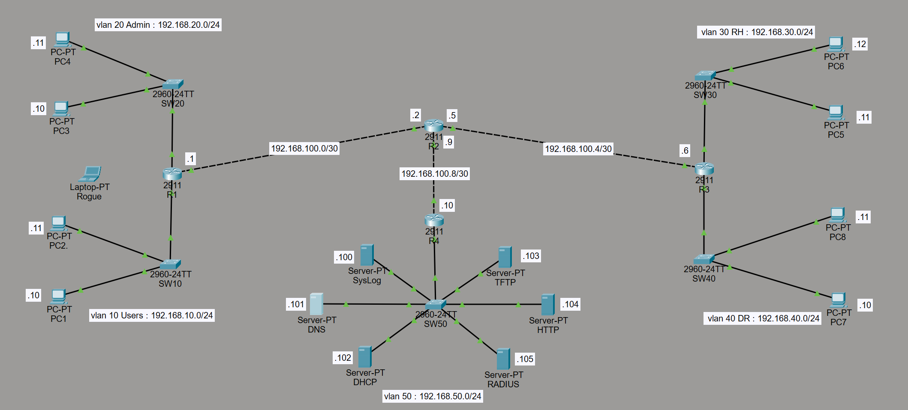
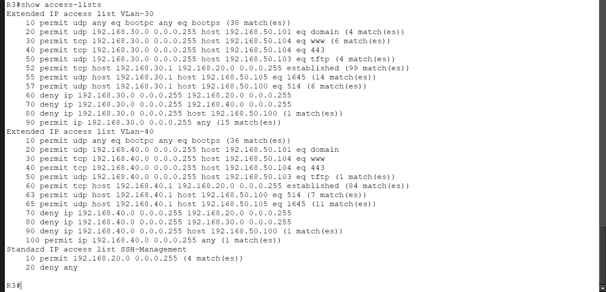
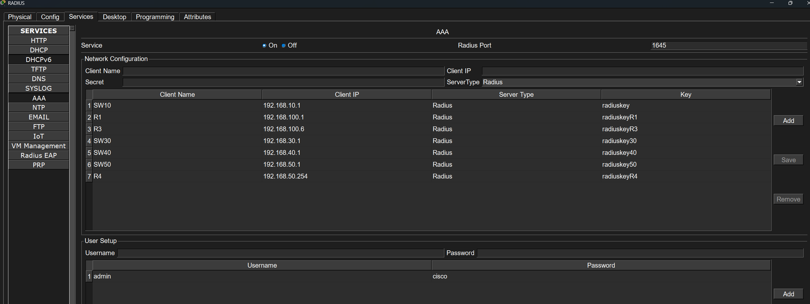
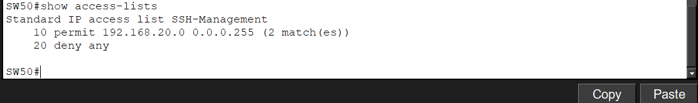
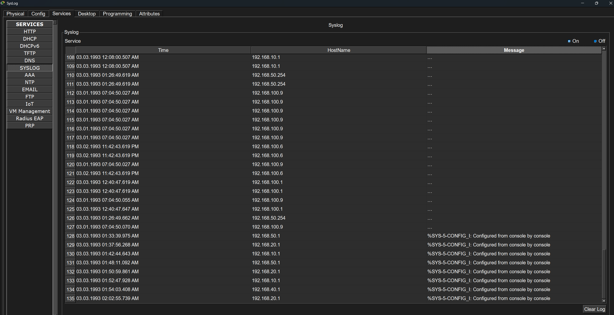
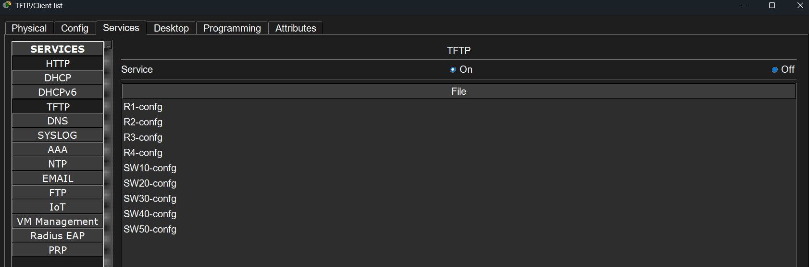
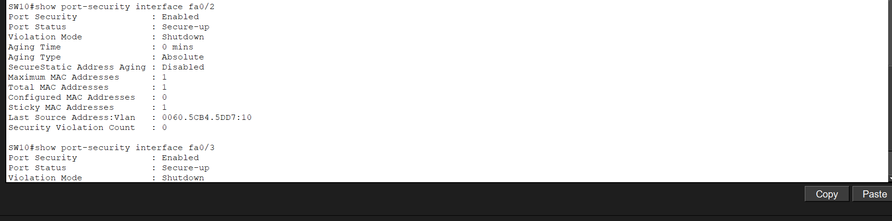
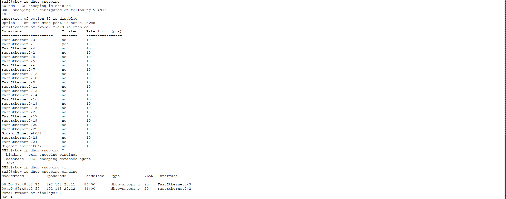
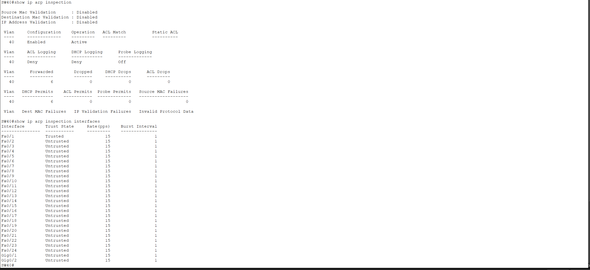

# Lab 10 : Network Security Hardening & Services

## Overview

This lab is focused on the security of a small company network using Cisco technologies.

The goal was, first, to make the network functional, and secondly, to apply security policies.

This topology includes a user VLAN, an admin/management VLAN, department VLANs, and also a server VLAN hosting the company services.

Technologies implemented:

- VLAN Segmentation
- Inter-VLAN Routing
- BPDU Guard / PortFast
- Rapid PVST+
- OSPF
- DHCP Relay
- DNS / HTTP Services
- TFTP Backup
- Extended ACLs
- VTY Access Control
- SSH Management
- RADIUS / AAA
- Syslog
- Port Security
- DHCP Snooping
- Dynamic ARP Inspection

---

## Objectives

- Build a complete multi-VLAN network using centralized services.
- Use ACLs to apply inter-VLAN restriction policies.
- Restrict device management to VLAN 20 only.
- Implement SSH using RADIUS but also local login.
- Centralize logs on a Syslog server.
- Back up device configurations to a TFTP server.
- Protect switches with Port Security and sticky MAC address, including the server switch with a secured configuration.
- Prevent rogue DHCP attacks using DHCP Snooping.
- Protect switches against ARP spoofing and ARP poisoning attacks using DAI.
- Validate the correct operation of the configuration and the security features that were implemented.

---

## Topology Overview

The topology is made of several VLANs connected through OSPF.

The server VLAN is exclusively composed of the following services:

- DHCP Server
- DNS Server
- HTTP Server
- Syslog Server
- TFTP Server
- RADIUS Server

VLAN 20 Admin has full access to all VLANs and also to all devices for management.



---

## Network Design and Addressing

### VLAN Design 

| VLAN | Name | Network | Role |
|---|---|---|---|
| 10 | Users | 192.168.10.0/24  | Standard Users |
| 20 | Admin | 192.168.20.0/24 | Network Administration |
| 30 | RH | 192.168.30.0/24 | Human Resources department |
| 40 | DR | 192.168.40.0/24 | Direction department |
| 50 | Server | 192.168.50.0/24 | Infrastructure Services |
| 999 | Blackhole | N/A | Unused ports |

### Server VLAN Services

| Service | IP Address | Purpose |
|---|---|---|
| SYSLOG | 192.168.50.100 | Centralized logging service |
| DNS | 192.168.50.101 | Centralized domain name service |
| DHCP | 192.168.50.102 | Centralized DHCP service |
| TFTP | 192.168.50.103 | Backup configuration service |
| HTTP | 192.168.50.104 | Web service |
| RADIUS | 192.168.50.105 | Centralized authentication service |

---

### Devices Running-Config

| Device | Config |
|---|---|
| SW10 | [SW10.txt](configs/SW10.txt) |
| SW20 | [SW20.txt](configs/SW20.txt) |
| SW30 | [SW30.txt](configs/SW30.txt) |
| SW40 | [SW40.txt](configs/SW40.txt) |
| SW50 | [SW50.txt](configs/SW50.txt) |
| R1 | [R1.txt](configs/R1.txt) |
| R2 | [R2.txt](configs/R2.txt) |
| R3 | [R3.txt](configs/R3.txt) |
| R4 | [R4.txt](configs/R4.txt) |

## Security Policy

### Inter-VLAN Access Policy

| Source VLAN | Allowed Access | Restricted Access |
|---|---|---|
| VLAN 10 | DNS - DHCP - TFTP - HTTP | VLAN 20 - VLAN 30 - VLAN 40 - Syslog - SSH Devices |
| VLAN 20 | Full Access | None |
| VLAN 30 | DNS - DHCP - TFTP - HTTP | VLAN 20 - VLAN 40 - Syslog - SSH Devices |
| VLAN 40 | DNS - DHCP - TFTP - HTTP | VLAN 20 - VLAN 30 - Syslog - SSH Devices |
| VLAN 50 | Services provider | No unrestricted user access |

### Management Access Policy 

Access to the devices is exclusively reserved to VLAN 20 Admin through SSH.

Authentication is done through the RADIUS server, except for R2 and SW20. In case the RADIUS server is down, local login remains available.

The following credentials are used only for this Packet Tracer lab.  
They are intentionally simple and must not be reused in a real environment.

| Access Type | Username | Password / Secret |
|---|---|---|
| RADIUS SSH user | admin | cisco |
| Local fallback user | localadmin | localpass |
| Enable secret | N/A | admin123 |

### ACLs Design Note

For the needs of this lab, I configured the ACLs as follows:

1. What is permitted is explicitly permitted.
2. What is restricted is also explicitly restricted.
3. The final permit allows the rest of the communications.
4. The servers should not freely initiate connections toward the VLANs or the Internet. They can only provide the authorized services.
5. The main filtering is applied on the client VLAN side, because classic ACLs are not stateful.

---

## Security Features & Verification 

### Extended ACLs

The extended ACLs are applied as close as possible to the source. Since this type of ACL is much more precise, it reduces the risk of allowing or denying unwanted traffic.

The ACLs are mainly used for inter-VLAN restrictions, but also for services.



### SSH / RADIUS

SSH is used for remote management.

A RADIUS server also authenticates connections to the devices. If the server is down, local login remains available.



### VTY Access Control

An ACL was applied on each VTY line of each device to allow only VLAN 20 to connect.



### Syslog

A Syslog server was set up to collect and centralize all important events.

Note that in Packet Tracer, only the debugging logging option was available.



### TFTP Backup

A TFTP server was set up to save the device configurations. This makes management easier and also provides more safety in case of a problem.



### Port Security

The Port Security feature is enabled on user access ports to avoid any unauthorized rogue device.



### DHCP Snooping

DHCP Snooping was applied on all switches in order to prevent rogue DHCP.

Only trusted ports, such as uplinks toward routers, were configured as trusted.

The packet-per-second limit was set to 10 on all switch ports in order to avoid a user port sending too many DHCP requests.



### Dynamic ARP Inspection

DAI was enabled on the user VLANs. The uplinks toward the routers were configured as trusted, while user ports remained untrusted.



### Remark

Dynamic ARP Inspection is based on the DHCP Snooping binding table, so I first enabled DHCP Snooping on the switches and waited for the tables to be populated in order to avoid DAI blocking legitimate traffic.

DHCP Snooping option 82 was disabled because in Packet Tracer, when it is enabled with DHCP Relay, it can break DHCP.

---

## Full Validation

| Feature | Test | Expected Result | Actual Result | Evidence |
|---|---|---|---|---|
| RADIUS | Admin VLAN connects to SW10 via SSH | Connection successful | Success | [RADIUS Server](screenshots/verification/SSH-RADIUS/RADIUS-Server.png) [SSH Test](screenshots/verification/SSH-RADIUS/PC3-SSH-SW10.png) |
| SYSLOG | Log received on server | Events logged | Success | [Syslog Server](screenshots/verification/Syslog/Syslog.png) |
| TFTP | Configurations backed up | Files saved | Success | [Tftp Server](screenshots/verification/Tftp/Tftp.png) |
| HTTP | Web server reachable using DNS | HTTP server working | Success | [WEB Access](screenshots/verification/HTTP/PC5-HTTP.png) |
| DHCP | Clients received IPs | DHCP assignment works | Success | [DHCP Server](screenshots/verification/DHCP/DHCP.png) [DHCP assignment](screenshots/verification/DHCP/PC8-DHCP-Assignement.png) |
| DNS | Internal records resolve correctly | Internal records working | Success | [DNS Server](screenshots/verification/DNS/DNS.png) [Ping records successful](screenshots/verification/DNS/PC3-Ping-Dns.png) |
| VLAN 10 ACL | Check if the ACLs are working | Unauthorized traffic blocked | Success | [Before VLAN-10 ACL](screenshots/verification/Acls/Vlan10/Before-ACLs/PC2-ping-PC3-PC5-Syslog-Tftp.png) [After VLAN-10 ACL](screenshots/verification/Acls/Vlan10/After-ACLs/PC2-ping-PC3-PC5-Syslog-Tftp.png) |
| VLAN 30 ACL | Check if the ACLs are working | Unauthorized traffic blocked | Success | [Before VLAN-30 ACL](screenshots/verification/Acls/Vlan30/Before-ACLs/PC5-Ping-PC3-PC7-Syslog.png) [After VLAN-30 ACL](screenshots/verification/Acls/Vlan30/After-ACLs/PC5-Ping-PC3-PC7-Syslog.png) |
| VLAN 40 ACL | Check if the ACLs are working | Unauthorized traffic blocked | Success | [Before VLAN-40 ACL](screenshots/verification/Acls/Vlan40/Before-ACLs/PC7-Ping-PC3-PC5-Syslog.png) [After VLAN-40 ACL](screenshots/verification/Acls/Vlan40/After-ACLs/PC7-Ping-PC3-PC5-Syslog.png) |
| VTY ACL | Only Admin VLAN 20 can manage devices | Admin VLAN authorized | Success | [VTY ACL](screenshots/verification/SSH-RADIUS/SW50-ACL-VTY.png) |
| Port Security | Unauthorized MAC triggers violation | Port in Err-Disabled | Success | [Err-Disabled](screenshots/verification/Port-Security/SW-10-fa02-err-disabled.png) |
| DHCP Snooping | Binding Table | Legitimate DHCP clients learned | Success | [Binding Table](screenshots/verification/DHCP-Snooping-DAI/SW20-Show-Ip-Dhcp-Snooping-Binding.png) |
| DAI | Legitimate ARP inspected and forwarded | ARP traffic forwarded | Success | [Arp Inspection interfaces](screenshots/verification/DHCP-Snooping-DAI/SW40-Show-Ip-Arp-inspection-Interfaces.png) |

---

## Troubleshooting

### Problem 1: SW10 Management Impossible from VLAN 20 Admin

During a test, I was unable to connect to SW10 through SSH from the Admin VLAN.

After many checks, everything seemed correct, until I inspected the `VLan-10` ACL.

Looking more closely, I realized that the ACL, which is stateless, was actually doing its job and was blocking the return connection:

```text
SW10 → VLAN 20
```

Cause: the ACL was blocking the return path toward the Admin VLAN.

Solution: implement an `established` ACE allowing TCP return connections.

This solution was also implemented in the `VLan-30` and `VLan-40` ACLs.

---

### Problem 2: The Syslog Server Does Not Receive Any Logs Anymore from SW10, SW30 and SW40

During verification of the logging system, I realized that the logs were no longer being centralized on the Syslog server.

After investigation, it turned out that the ACLs were once again doing their job by blocking connections from these VLANs toward the Syslog server.

So I needed to create an exception to still allow these switches to send their logs to the server.

Cause: the ACLs were blocking access to the Syslog server.

Solution: implement an ACE that allows UDP connections on port 514 toward the Syslog server.

---

### Problem 3: No Connectivity from PC2

During a connectivity test, I realized that PC2 could no longer reach any remote network.

I ran a `tracert` to understand where it was blocked and, to my surprise, the traffic stopped at the default gateway.

After checking with `ipconfig`, I saw that the PC did not have a default gateway configured, even though the configuration was done through DHCP.

So I checked if the DHCP server had a default gateway correctly configured in the pool, which was the case.

I then executed the following commands on PC2:

```bash
ipconfig /release
ipconfig /renew
```

After that, PC2 correctly received the default gateway.

Cause: no default gateway was configured on PC2 through DHCP, probably because of a Packet Tracer bug or an incomplete DHCP renewal.

Solution: renew the DHCP lease with:

```bash
ipconfig /release
ipconfig /renew
```

---

### Problem 4: DHCP Failed After the DHCP Snooping Configuration

During a verification after implementing DHCP Snooping, I realized that DHCP was no longer working.

After investigation, I could not find the problem alone. That is when I asked AI to help me. It quickly identified the issue.

I had forgotten to put the port toward R1 in trust, which had the effect of blocking the legitimate DHCP traffic.

Cause: the port toward R1 was not configured as trusted.

Solution: put the port toward R1 in trust in order to allow legitimate DHCP traffic.

This solution was then applied to all the other concerned switches.

---

## Skills Gained

- Built and applied extended ACLs for inter-VLAN filtering.
- Understood ACL order and the impact of the final permit statement.
- Configured SSH-based device management.
- Integrated RADIUS authentication with local fallback.
- Restricted VTY access to an Admin VLAN.
- Configured Syslog for centralized event logging.
- Used TFTP to back up network device configurations.
- Implemented Port Security with sticky MAC learning.
- Tested Port Security violations and err-disabled behavior.
- Configured DHCP Snooping and trusted/untrusted ports.
- Configured Dynamic ARP Inspection based on DHCP Snooping bindings.
- Validated security controls using Cisco verification commands.
- Layer 2 hardening.

## Key Concepts Learned

- Extended ACLs should be placed close to the source.
- ACL entries are processed from top to bottom.
- The final `permit ip ... any` does not override previous deny entries.
- Cisco IOS ACLs are stateless.
- DHCP traffic needs special ACL handling because clients initially use `0.0.0.0`.
- Management traffic may require exceptions when management IPs are in user VLANs.
- RADIUS uses a shared secret between the device and server, separate from the user password.
- Local fallback is important to avoid being locked out.
- DHCP Snooping is required before DAI can validate ARP traffic dynamically.
- Only uplinks should normally be trusted for DHCP Snooping and DAI.
- Port Security in shutdown mode places the interface into err-disabled state.
- Syslog helps confirm and document security events.

---
