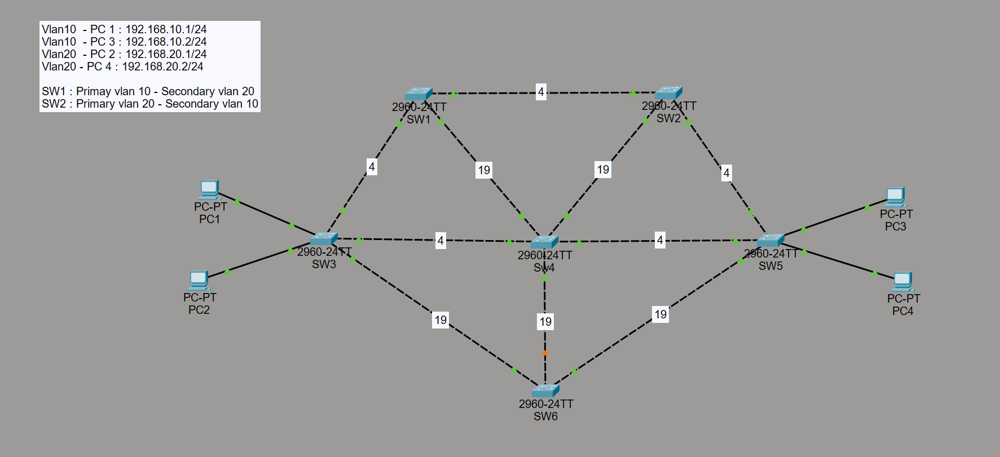
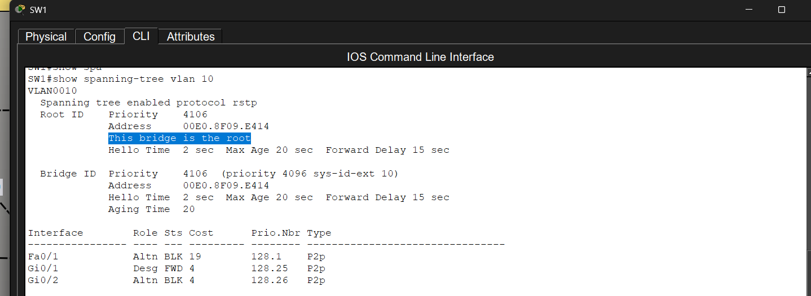
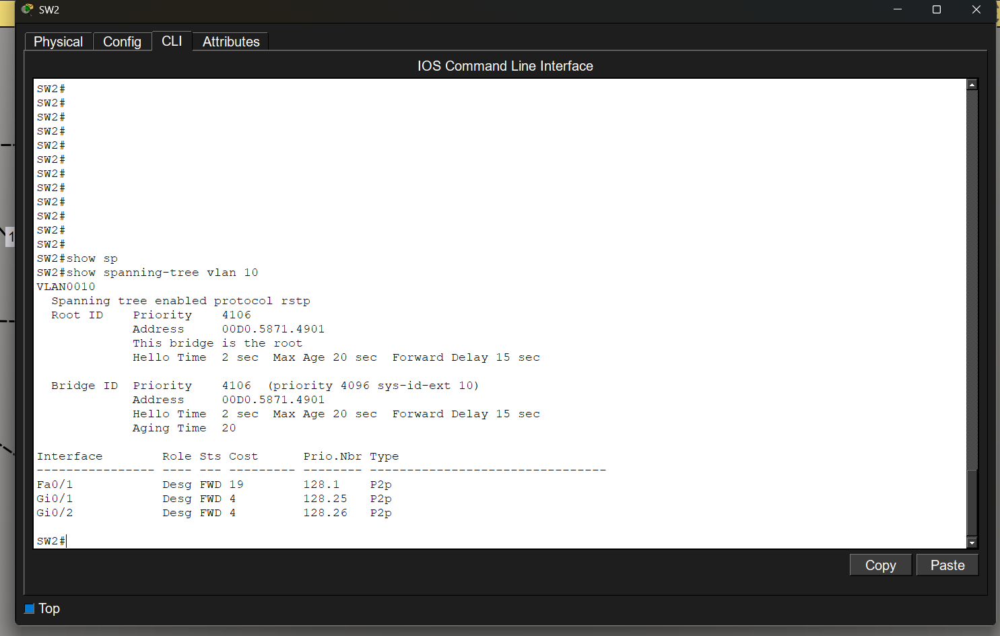
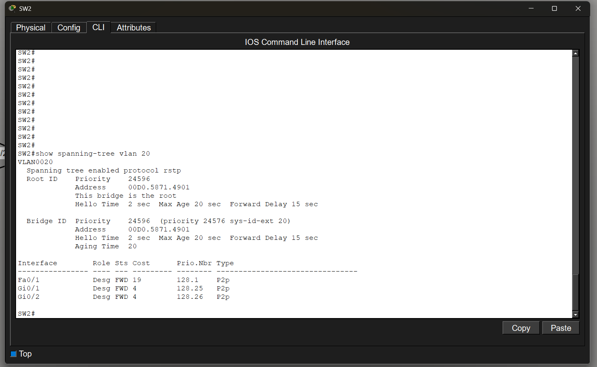

# Lab RPVST+ : Scenario 1 (Default)

## Objective

Creation of a network of 6 switches in order to observe the behavior of RPVST+

## Topology



### Equipment

- 6 Cisco 2960 switches
- 4 PCs

### VLANs

- VLAN 10 : Users
- VLAN 20 : HR

## Network Configuration

### VLAN 10 — Root bridge : SW1

- SW1 = all ports are in Designated state

| Switch | Port | Role | State | Cost |
|---|---|---|---|---|
| SW2 | Gi0/1 | Root | Forwarding | 4 |
| SW2 | Gi0/2 | Designated | Forwarding | 4 |
| SW2 | Fa0/1 | Designated | Forwarding | 19 |
| SW6 | Fa0/1 | Alternate | Blocking | 19 |
| SW6 | Fa0/2 | Alternate | Blocking | 19 |
| SW6 | Fa0/3 | Root | Forwarding | 19 |

### VLAN 20 — Root bridge : SW2

- SW2 = all ports are in Designated state

| Switch | Port | Role | State | Cost |
|---|---|---|---|---|
| SW1 | Gi0/1 | Designated | Forwarding | 4 |
| SW1 | Fa0/1 | Root | Forwarding | 19 |
| SW4 | Gi0/1 | Alternate | Blocking | 4 |
| SW4 | Gi0/2 | Root | Forwarding | 4 |
| SW6 | Fa0/1 | Alternate | Blocking | 19 |
| SW6 | Fa0/2 | Root | Forwarding | 19 |

## Configuration

| Device | Configuration |
|---|---|
| SW1 | [SW1.txt](Configs/SW1.txt) |
| SW2 | [SW2.txt](Configs/SW2.txt) |
| SW3 | [SW3.txt](Configs/SW3.txt) |
| SW4 | [SW4.txt](Configs/SW4.txt) |
| SW5 | [SW5.txt](Configs/SW5.txt) |
| SW6 | [SW6.txt](Configs/SW6.txt) |

## Verification

```bash
show vlan brief

show interface trunk

show spanning-tree

show spanning-tree vlan 10

show spanning-tree vlan 20
```

## Troubleshooting

### Alternate/BLK Ports on the VLAN 10 Root Bridge

#### Problem

Fa0/1 and Gi0/2 on SW1 were appearing as Altn BLK for VLAN 10 even though SW1 was elected as root bridge.



#### Cause

SW2 had the same priority as SW1 (4096) on VLAN 10.

The STP tie-breaker (lowest MAC address) gave the advantage to SW2, which was finally elected as root bridge for VLAN 10.



#### Solution

```bash
SW2(config)# spanning-tree vlan 10 priority 24576
```



#### Result

After modifying SW2, all active ports on SW1 moved to Designated - Forwarding state.

## Observation

- The Root bridge is elected based on the lowest priority and, in case of equality, the switch with the lowest MAC address is elected.
- The root bridge does not have a root port.
- All ports on the root bridge are in Designated state.

- The root port is the port with the shortest path toward the root bridge.
- The Designated port is the preferred port on a given segment.
- The Alternate port is the alternative port toward the root if the root port fails.

- The root port can only be in Forwarding state.
- The Designated port can only be in Forwarding state.
- The Alternate port can only be in Blocking state.

- STP costs vary depending on the speed of the media used.

- PortFast allows a switch port to move directly into Forwarding state.
- BPDU Guard disables a port if a switch is connected to it while configured with PortFast, and places it into err-disabled state.

## Skills gained

- I learned why certain ports move into specific roles/states.
- I learned the STP cost values.
- I learned that PVST+ assigns a dedicated STP instance to each VLAN.

- I learned how to configure a root bridge by manipulating the priority.
- I learned how to configure a primary & secondary root bridge for load balancing.
- I learned the role of PortFast and BPDU Guard.

- I learned that by manipulating costs, I could force specific traffic to take specific paths in order to prevent all VLANs from using the same paths and creating congestion as well as wasting resources (STP load balancing).