# Lab OSPF

## Part 1 - Initial OSPF Deployment

### Objective

Créer une architecture complete incluant les réseaux broadcast mullti-access et Point-to-Point
---

### Full Topology

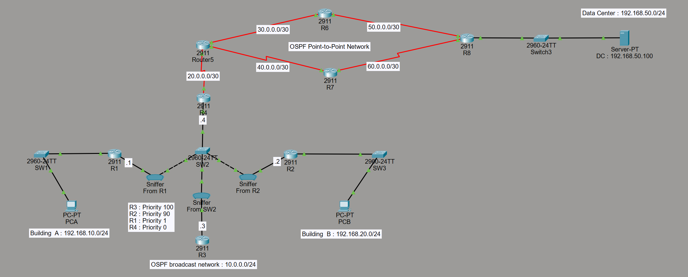
---

### Network Configuration 

Tableau 1 : plan d'adressage 

| Router | Interface | IP | Mask |
|---|---|---|---|
| R1 | G0/0 | 10.0.0.1 | /24 |
| R1 | G0/1 | 192.168.10.1 | /24 | *
| R2 | G0/0 | 10.0.0.2 | /24 |
| R2 | G0/1 | 192.168.20.1 | /24 | *
| R3 | G0/0 | 10.0.0.3 | /24 |
| R4 | G0/0 | 10.0.0.4 | /24 |
| R4 | SE0/0/0 | 20.0.0.1 | /30 |
| R5 | SE0/0/0 | 20.0.0.2 | /30 |
| R5 | SE0/0/1 | 30.0.0.1 | /30 |
| R5 | SE0/1/0 | 40.0.0.1 | /30 |
| R6 | SE0/0/0 | 30.0.0.2 | /30 |
| R6 | SE0/0/1 | 50.0.0.1 | /30 |
| R7 | SE0/0/1 | 40.0.0.2 | /30 |
| R7 | SE0/0/0 | 60.0.0.1 | /30 |
| R8 | SE0/0/1 | 50.0.0.2 | /30 |
| R8 | SE0/0/0 | 60.0.0.2 | /30 |
| R8 | G0/0 | 192.168.50.1 | /24 | *

Interface en mode passive :
 - R1-G0/1
 - R2-G0/1
 - R8-G0/0

Tableau 2 : OSPF configuration

| Router | Router ID| Priority | Role | Network type |
|---|---|---|---|---|
| R1 | 1.1.1.1 | 1 | DROTHER | Broadcast |
| R2 | 2.2.2.2 | 90 | BDR | Broadcast |
| R3 | 3.3.3.3 | 100 | DR | Broadcast |
| R4 | 4.4.4.4 | 0 | DROTHER | Broadcast |
| R5 | Auto | N/A | N/A | P2P |
| R6 | Auto | N/A | N/A | P2P |
| R7 | Auto | N/A | N/A | P2P |
| R8 | Auto | N/A | N/A | P2P |

### Configuration

Vous trouverez ici le show run de chacun des routeurs :

| Router | Configuration |
|---|---|
| R1 | [R1.txt](configs/R1.txt) |
| R2 | [R2.txt](configs/R2.txt) |
| R3 | [R3.txt](configs/R3.txt) |
| R4 | [R4.txt](configs/R4.txt) |
| R5 | [R5.txt](configs/R5.txt) |
| R6 | [R6.txt](configs/R6.txt) |
| R7 | [R7.txt](configs/R7.txt) |
| R8 | [R8.txt](configs/R8.txt) |
---

### Verification

Table de routage de R8

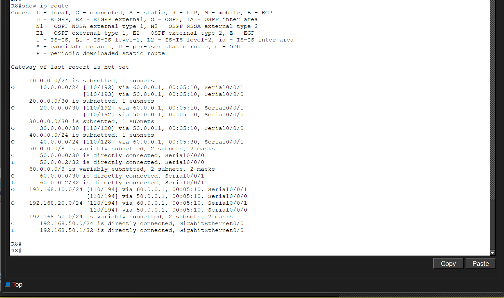

 -Nous observons bien toutes les routes OSPF vers tous les réseaux 
---

Database de R8

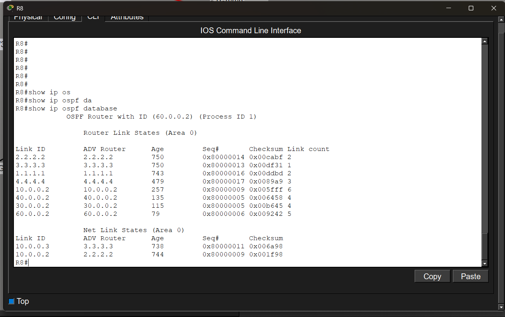

 -Nous observons bien tous les LSAs de tous les routeurs, 8 en tout. Ainsi que les network LSAs
---

Ping depuis PCA vers DC et PCB successful

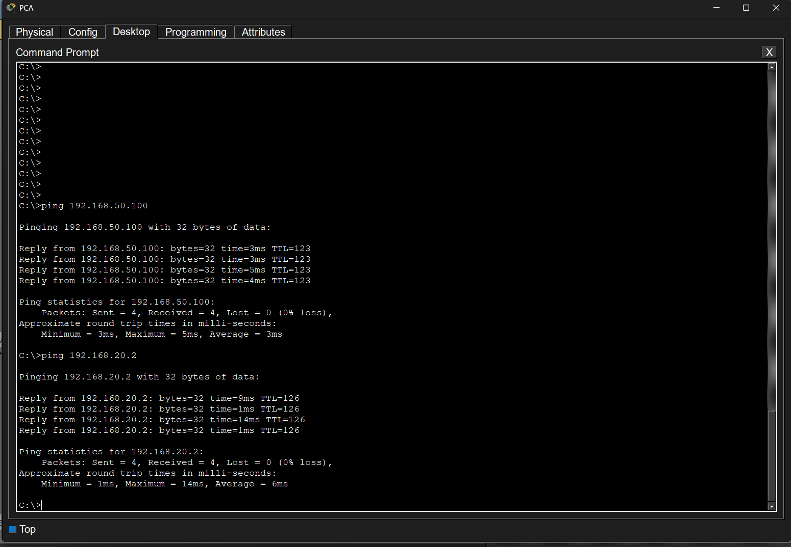

 -Nous observons que tous les pings passent sans le moindre problème 
---

Tracert depuis PCB vers DC et PCA successful

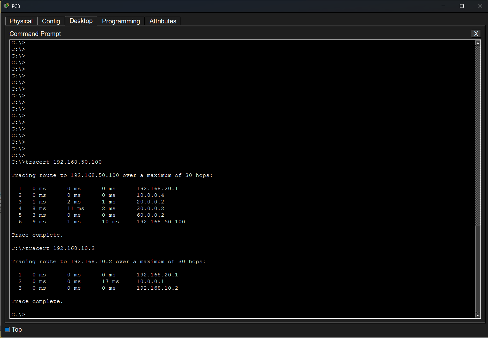

 -Nous observons le chemin que prennent les paquets vers les différentes desitnations
---
### Troubleshooting

### Observations

------------------------------------------------

## Part 2 - Broadcast Multi-Access Analysis

### Broadcast Segment Topology

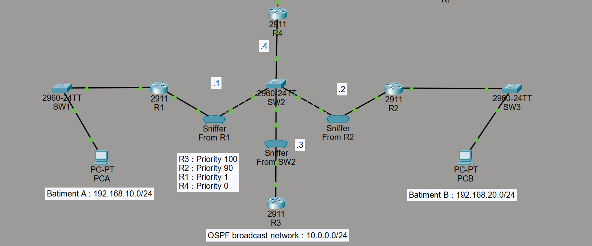
---

### DR / BDR Election

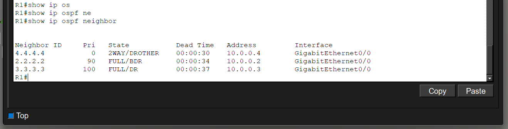

 -Router 3 est élu DR car il a la priorité la plus haute sur le segment.
 -Router 2 est élu BDR car il a la deuxième priorité la plus élevée.
 -En cas d'égalité sur la priorité, le tie-breaker aurais tranché sur base du router-id la plus élevé 

---

### DR Failure Simulation

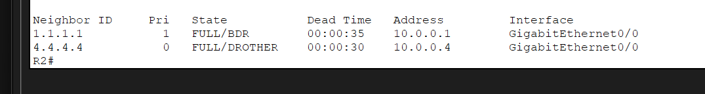

L’interface G0/0 de R3 est mise hors ligne afin de simuler une panne du DR., ce qui entraine à la fin du dead-interval un basculement de DR sur le BDR

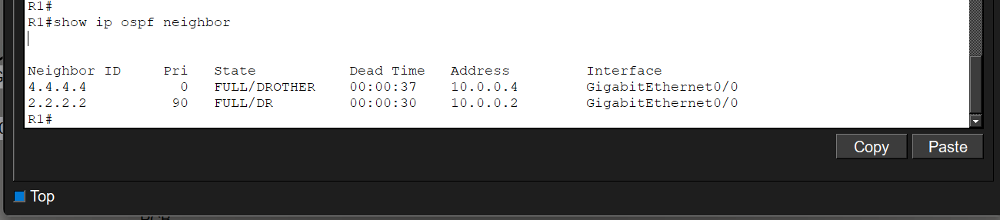

R2 est devenu DR suite au problème survenu sur le DR, R2 est élu DR car il était BDR avec une priorité de 90

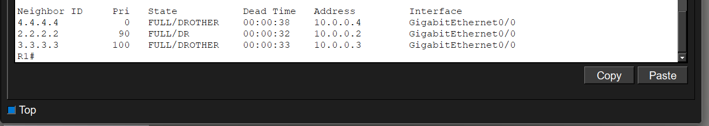

R3 revient en ligne, malgré sa priorité la plus élevé, il ne redevient pas DR car OSPF est ce que l'on appelle non-preemtive

### OSPF Packet Analysis

Voici les différents packet OSPF capturés dans les sniffers

 - Le Hello packet

Packet de type1 envoyé par R1 à l'adresse multicast 224.0.0.5 par le router pour établir un voisinage et signaler qu'il est toujours en "vie"
---
 - Le Database descrition packet

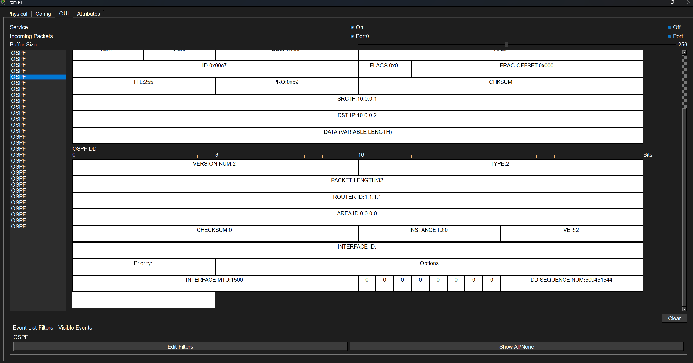

Packet de type2 envoyé par R1 à l'adresse 10.0.0.2 (unicast) afin de partager sa data base avec R2
---
 - Le Link state request packet

Packet de type3 envoyé par R4 à l'adresse 10.0.0.3 afin de réclamer des informations manquante sur R3
---
 - Le Link state Update packet

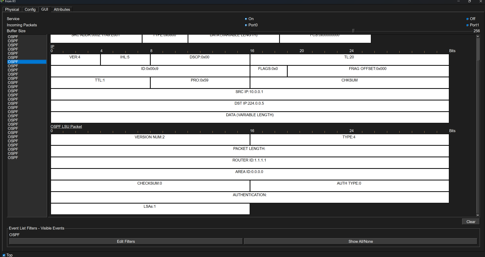

Packet de type4 envoyé par R1 à l'adresse Multicast 224.0.0.5 afin de partager la MAJ de sa Database aux autres
---

 - Le Link state acknowledgement packet

Packet de type5 envoyé par R1 à l'adresse Multicast 224.0.0.5 afin d'accuser réception des informations réclamées aux autres
---

 - Le Link state acknowledgement packet (224.0.0.6)

Encore un packet de type5 LSAck mais cette fois envoyé par R1 à l'adresse Multicast 224.0.0.6 qui est destinée au DR/BDR uniquement
---

### Observations

- Une fois que le DR est offline et qu'il revient online, il n'est plus DR car OSPF est no-preemtive.

- Je remarque aussi que les Routeurs même en états full peuvent envoyé des paquets unicast aux DROTHER pour avoir certaines informations manquante, donc l'état full ne veux pas forcément dire une communication exclusive en multicast 224.0.0.5 pour tout le monde et 224.0.0.6 pour DR/BDR

- Je remarque également que seules les paquets LSU contiennent réellement des LSA complets

- Multicast 224.0.0.5 = Tout le monde

- Multicast 224.0.0.6 = DR/BDR
---

------------------------------------------------

## Part 3 - Point-to-Point WAN Analysis

### WAN Topology

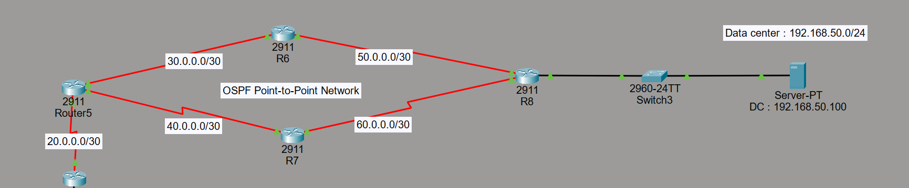
---

### Link Failure Simulation

 - Je tracert le DC depuis PCA afin de constater le chemin initial des paquets ICMP :

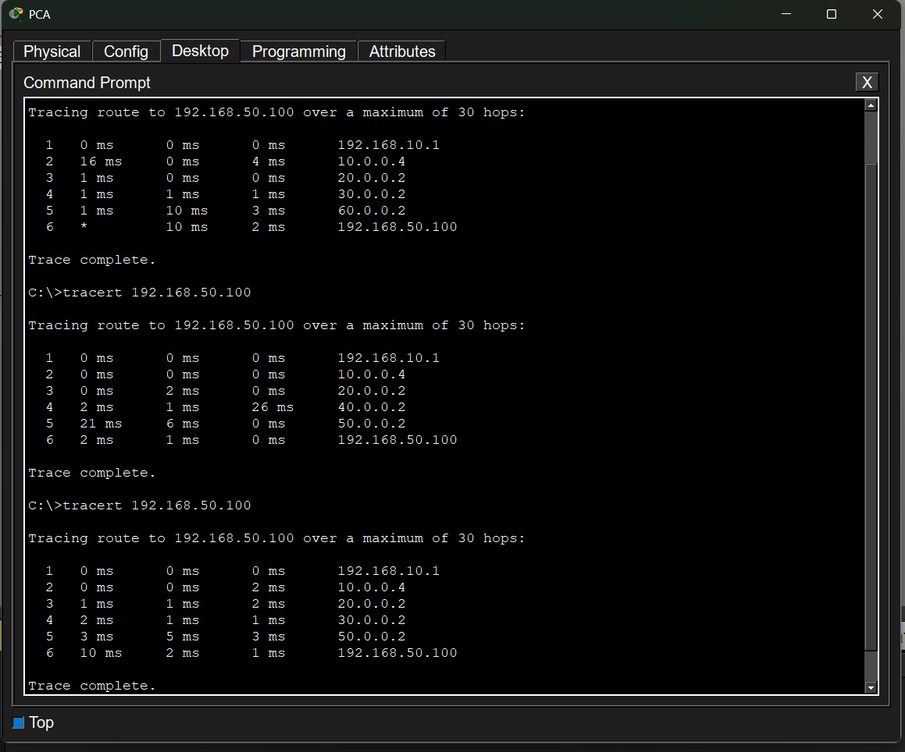

 - Les paquets ICMP prenne une des routes différentes à partir du R5, ce comportement ne me semble pas normal
---

Voici la table de routage de R5 qui montre les deux routes du même coût 

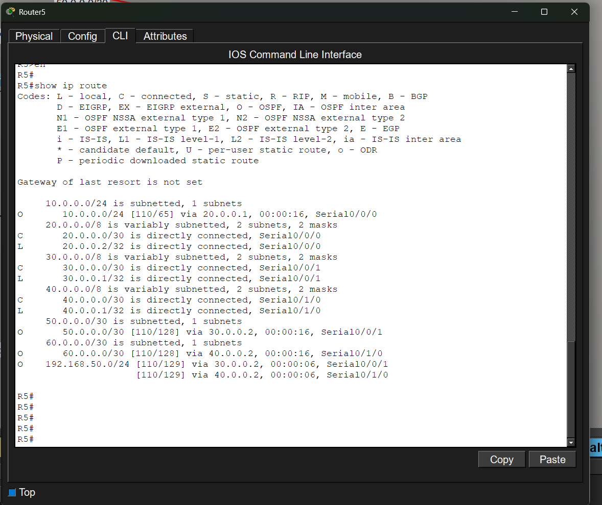

 - La table de routage nous montre que deux routes sont disponible vers le réseau 192.168.50.0/24 (toutes les deux a 129 de coût) avec le même coût ce qui d'éclanche le mécanisme ECMP. Donc le comportement des paquets ICMP lors du tracert de PCA au DC sont un comportement normal finalement

 - l'AD quand à elle reste la même car c'est l'AD par défaut d'OSPF 
---

 - Je shut volontairement les interface de R7 afin d'observer le chemin que va prendre les pings :

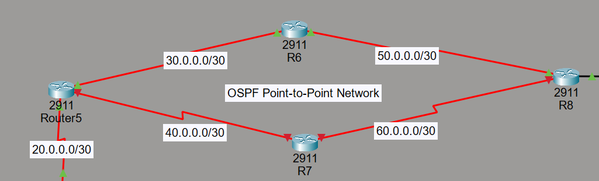

 - Lors du shut de R7 le dead-interval arrive a 0 sur les routeurs ce qui a pour effet de retirer R7 de leurs Database
---

 - Voici la table de routage de R5 après le shutdown de R7

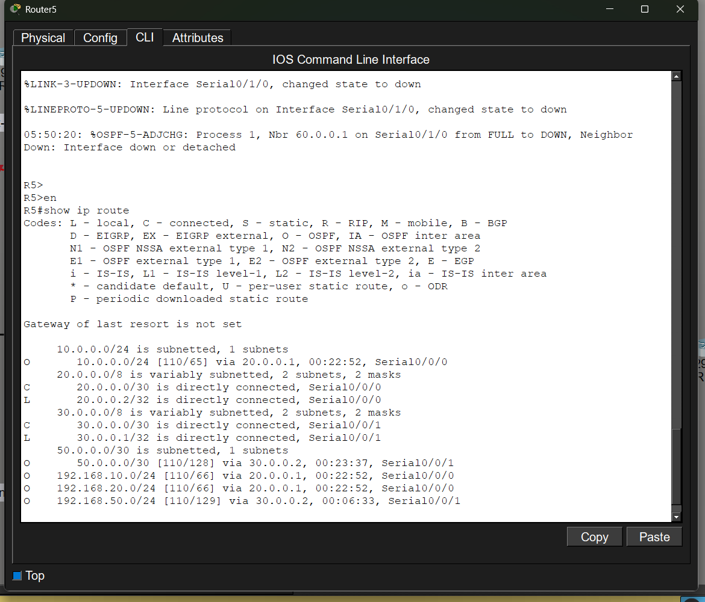

 - La table de routage ne montre plus qu'une seule route disponible vers le Réseau 192.168.50.0/24
---

 - Je tracert le DC depuis PCA après le shut de R7 pour constater le nouveau chemin que prennent les paquets ICMP

Les paquets ICMP prennent maintenant la seule route disponible jusqu'au réseau 192.168.50.0/24

### Verification

### OSPF States Analysis

### Observations

Lors du tracert de PCA vers Data center, je remarque que la sortie est étrange, cela s'explique par le ECMP (Equal-Cost-Multi-Path). Les routes vers DC (192.168.50.0) on le même coût ce qui enclenche le mécanisme ECMP et répartis les paquets entre les deux routes du même coût.

---------------------------------------

## Skills Gained