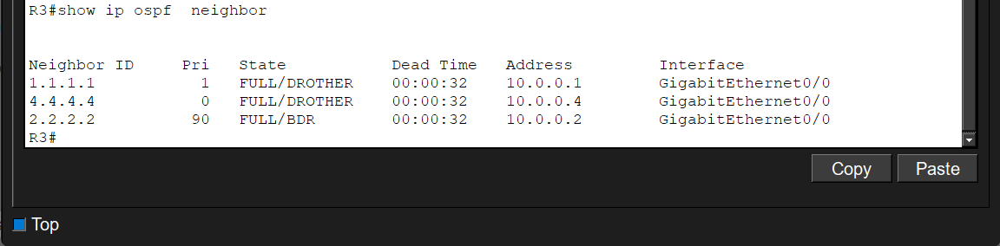
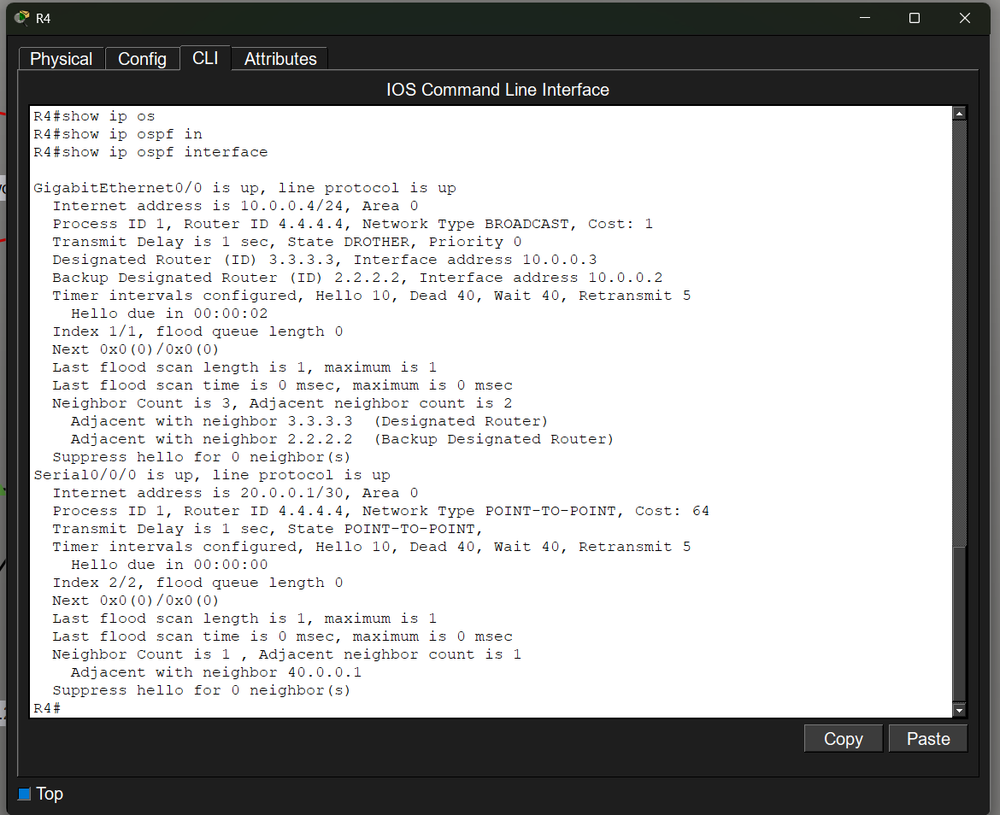
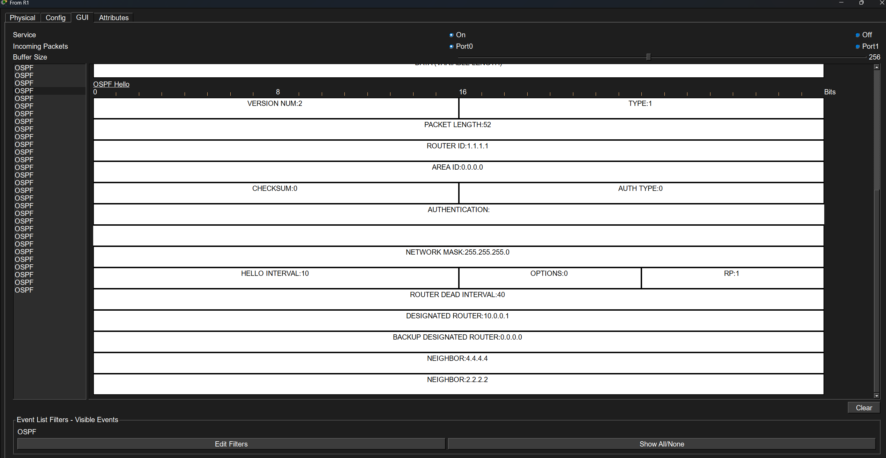
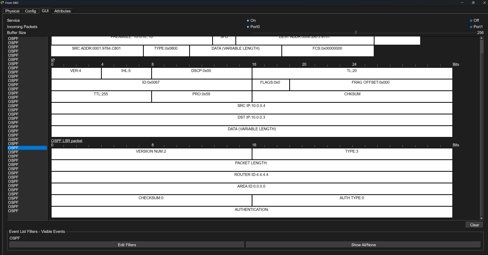
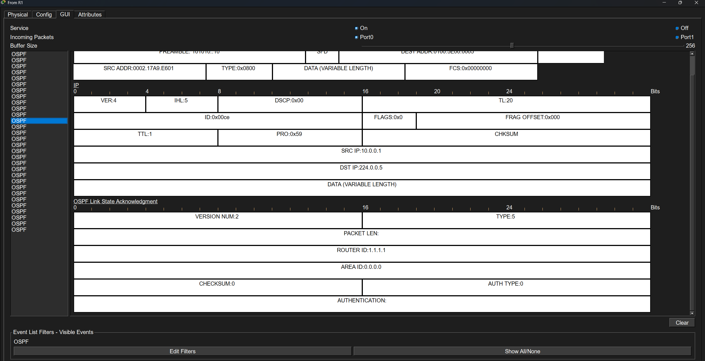
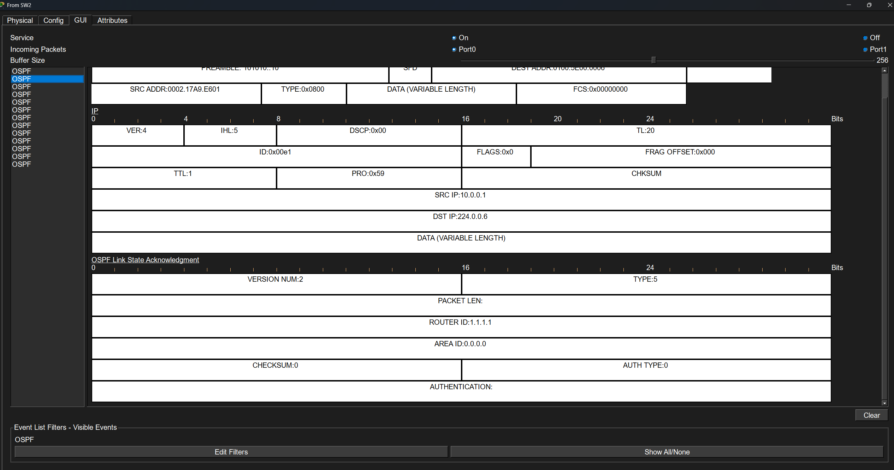
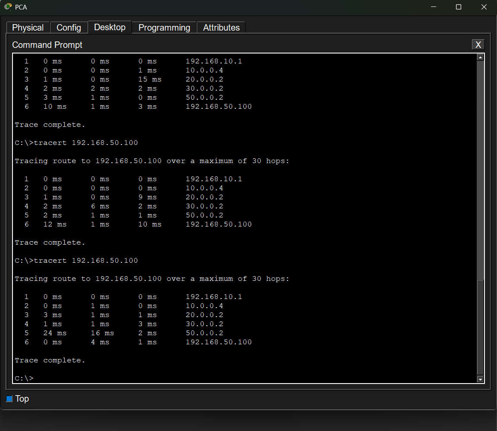
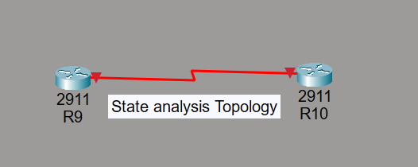
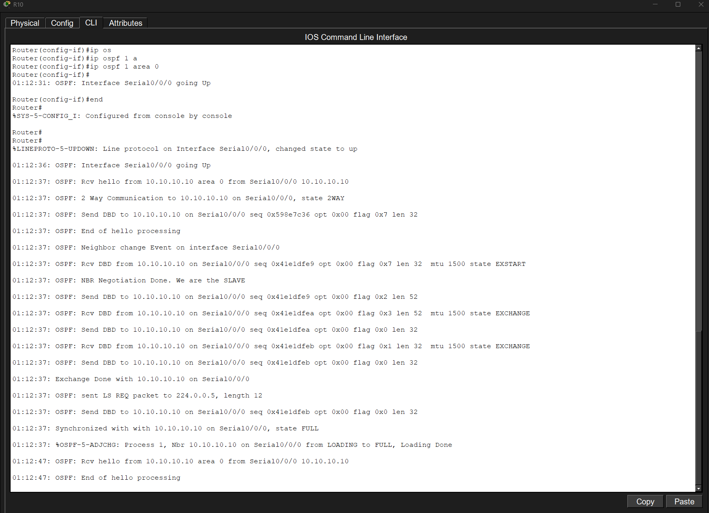

# Lab OSPF

## Part 1 - Initial OSPF Deployment

### Objective

Build a complete architecture including Broadcast Multi-Access and Point-to-Point networks.

---

### Full Topology


---

### Network Configuration

Table 1: Addressing Plan

| Router | Interface | IP           | Mask |   |
| ------ | --------- | ------------ | ---- | - |
| R1     | G0/0      | 10.0.0.1     | /24  |   |
| R1     | G0/1      | 192.168.10.1 | /24  | * |
| R2     | G0/0      | 10.0.0.2     | /24  |   |
| R2     | G0/1      | 192.168.20.1 | /24  | * |
| R3     | G0/0      | 10.0.0.3     | /24  |   |
| R4     | G0/0      | 10.0.0.4     | /24  |   |
| R4     | SE0/0/0   | 20.0.0.1     | /30  |   |
| R5     | SE0/0/0   | 20.0.0.2     | /30  |   |
| R5     | SE0/0/1   | 30.0.0.1     | /30  |   |
| R5     | SE0/1/0   | 40.0.0.1     | /30  |   |
| R6     | SE0/0/0   | 30.0.0.2     | /30  |   |
| R6     | SE0/0/1   | 50.0.0.1     | /30  |   |
| R7     | SE0/0/1   | 40.0.0.2     | /30  |   |
| R7     | SE0/0/0   | 60.0.0.1     | /30  |   |
| R8     | SE0/0/1   | 50.0.0.2     | /30  |   |
| R8     | SE0/0/0   | 60.0.0.2     | /30  |   |
| R8     | G0/0      | 192.168.50.1 | /24  | * |

Passive Interfaces:

* R1-G0/1
* R2-G0/1
* R8-G0/0

Table 2: OSPF Configuration

| Router | Router ID | Priority | Role    | Network Type |
| ------ | --------- | -------- | ------- | ------------ |
| R1     | 1.1.1.1   | 1        | DROTHER | Broadcast    |
| R2     | 2.2.2.2   | 90       | BDR     | Broadcast    |
| R3     | 3.3.3.3   | 100      | DR      | Broadcast    |
| R4     | 4.4.4.4   | 0        | DROTHER | Broadcast    |
| R5     | Auto      | N/A      | N/A     | P2P          |
| R6     | Auto      | N/A      | N/A     | P2P          |
| R7     | Auto      | N/A      | N/A     | P2P          |
| R8     | Auto      | N/A      | N/A     | P2P          |

### Configuration

You can find the show run of each router here:

| Router | Configuration            |
| ------ | ------------------------ |
| R1     | [R1.txt](configs/R1.txt) |
| R2     | [R2.txt](configs/R2.txt) |
| R3     | [R3.txt](configs/R3.txt) |
| R4     | [R4.txt](configs/R4.txt) |
| R5     | [R5.txt](configs/R5.txt) |
| R6     | [R6.txt](configs/R6.txt) |
| R7     | [R7.txt](configs/R7.txt) |
| R8     | [R8.txt](configs/R8.txt) |

---

### Verification

#### R8 Routing Table


* We can observe in this screenshot all OSPF routes to all networks.

---

#### OSPF Neighbor Table



* We can observe in this screenshot the neighbors of R3.
* These neighbors are Routers 1, 2 and 4.
* We can also observe that Router 2 is the BDR and that Routers 4 and 1 are in a Full state with Router 3 (DR).

---

#### R8 Database


* We can observe in this screenshot all LSAs from all routers, 8 in total.
* We can also observe the Network LSAs.

---

#### R4 Interfaces



* We can observe in this screenshot all OSPF information related to R4 interfaces.
* We can observe that the protocol is up, that it belongs to Area 0 and that the Process ID is 1.
* We can also observe the router ID of the router as well as the DR (R3) and the BDR (R2).
* We can observe the timers: Hello every 10 seconds and a Dead Interval of 40 seconds (4 x Hello).
* We can also observe the network type: Broadcast and Point-to-Point, as well as the cost.

---

#### Successful Ping from PCA to DC and PCB


* We can observe in this screenshot that all pings are successful without any issue.

---

#### Successful Tracert from PCB to DC and PCA


* We can observe in this screenshot the path taken by packets to the different destinations.

---

### Troubleshooting

#### Problem 1: No route leading to Building B 192.168.20.0

* Cause: No network was advertised into OSPF on R2.
* Solution: I used tracert, which allowed me to identify on which routers the issue was located. I then found the problem and enabled OSPF on interface G0/0 10.0.0.2/24.

---

#### Problem 2: When changing the priority of R2 and R3 to modify the DR/BDR election, no change occurred

* Cause: OSPF is non-preemptive, which prevents an automatic change of the DR and BDR.
* Solution: Use the `clear ip ospf process` command or perform a shut/no shut on the interfaces connected to SW2 so that OSPF reinitializes.

---

## Part 2 - Broadcast Multi-Access Analysis

### Broadcast Segment Topology


---

### DR / BDR Election


* Router 3 is elected DR because it has the highest priority on the segment.
* Router 2 is elected BDR because it has the second highest priority.
* In the event of a priority tie, the tie-breaker would have selected the router with the highest router ID.

---

### DR Failure Simulation


* R3's G0/0 interface is brought down in order to simulate a DR failure, which causes the BDR to take over as DR once the Dead Interval expires.

---


* R2 became the DR after the failure of the previous DR. R2 was elected DR because it was the BDR with a priority of 90.

---


* R3 comes back online, but despite having the highest priority, it does not become DR again because OSPF is what is known as non-preemptive.

---

### OSPF Packet Analysis

#### Here are the different OSPF packets captured using sniffers.

* Hello Packet



The Hello packet is a Type 1 packet sent by R1 to the multicast address 224.0.0.5 in order to establish neighbor relationships and indicate that it is still alive.

---

* Database Description Packet


The Database Description packet is a Type 2 packet sent by R1 to the address 10.0.0.2 (unicast) in order to share its database with R2.

---

* Link State Request Packet



The LSR is a Type 3 packet sent by R4 to the address 10.0.0.3 in order to request missing information from R3.

---

* Link State Update Packet


The LSU is a Type 4 packet sent by R1 to the multicast address 224.0.0.5 in order to share updates to its database with the other routers.

---

* Link State Acknowledgement Packet



The LSAck is a Type 5 packet sent by R1 to the multicast address 224.0.0.5 in order to acknowledge receipt of the requested information.

---

* Link State Acknowledgement Packet (224.0.0.6)



Another Type 5 LSAck packet, but this time sent by R1 to the multicast address 224.0.0.6, which is reserved for the DR and BDR only.

---

### Observations

* Once the DR goes offline and then comes back online, it is no longer the DR because OSPF is non-preemptive.

* I also noticed that routers, even when in a Full state, can send unicast packets to DROTHER routers in order to obtain missing information. Therefore, the Full state does not necessarily mean that communication is exclusively done using multicast 224.0.0.5 for everyone and 224.0.0.6 for the DR/BDR.

* I also noticed that only LSU packets actually contain complete LSAs.

* Multicast 224.0.0.5 = Everyone

* Multicast 224.0.0.6 = DR/BDR

---

## Part 3 - Point-to-Point WAN Analysis

### WAN Topology


---

### Link Failure Simulation

#### Tracert to the DC from PCA in order to observe the initial path taken by ICMP packets:


* ICMP packets take different paths starting from R5, which does not seem like normal behavior to me.

---

#### R5 Routing Table Showing the Two Equal-Cost Routes


* The routing table shows that two routes are available to reach the 192.168.50.0/24 network (both with a cost of 129). Since both routes have the same cost, the ECMP mechanism is triggered. Therefore, the behavior of the ICMP packets during the tracert from PCA to the DC is actually normal.

* The AD remains the same because it is the default OSPF Administrative Distance.

---

#### Manual Shutdown of R7 Interfaces in Order to Observe the Path Taken by the Pings


* When R7 is shut down, the Dead Interval reaches 0 on the routers, which causes R7 to be removed from the Neighbor Table.

---

#### OSPF Convergence

After shutting down R7:

1. The Dead Interval expires.
2. R7 is removed from the neighbor table.
3. The LSAs are updated.
4. The SPF algorithm is recalculated.
5. Traffic is automatically redirected.

This convergence provides redundancy and allows the network to continue operating after a link failure without manual intervention.

---

#### R5 Routing Table After the Shutdown of R7


* The routing table now shows only a single available route to reach the 192.168.50.0/24 network.

---

#### Tracert to the DC from PCA After Shutting Down R7 to Observe the New Path Taken by ICMP Packets



* ICMP packets now take the only available route to reach the 192.168.50.0/24 network.

### Verification

```Cisco
 - show ip route
 - show ip ospf neighbors
 - show ip ospf interface
 - show ip ospf database
 - Tracert
 - Ping
```

### OSPF States Analysis

#### Topology



---

#### OSPF States in a Point-to-Point Network

Debug command capture:



* We can observe in this screenshot the different stages that routers go through in OSPF.

* 1 : 2-Way : the routers can see each other and become neighbors.

* 2 : ExStart : negotiation to determine which router is the master and which is the slave. In this case, we are the slave.

* 3 : Exchange : exchange of databases.

* 4 : Loading : exchange of missing information (LSR/LSU).

* 5 : Full : the routers have now fully synchronized their LSDBs.

---

### Observations

* Since this is a Point-to-Point connection, it is normal that no DR or BDR election takes place. This election only occurs on Ethernet Broadcast Multi-Access networks.

---

## Skills Gained

* Configure OSPF on Broadcast and Point-to-Point networks
* Understand DR and BDR elections
* Capture and analyze different OSPF packets
* Observe OSPF neighbor states using debug commands
* Understand how routers build and synchronize their LSDBs
* Observe OSPF behavior during a link failure
* Understand how ECMP works
* Use the main OSPF verification commands
* Troubleshoot OSPF-related issues

---

